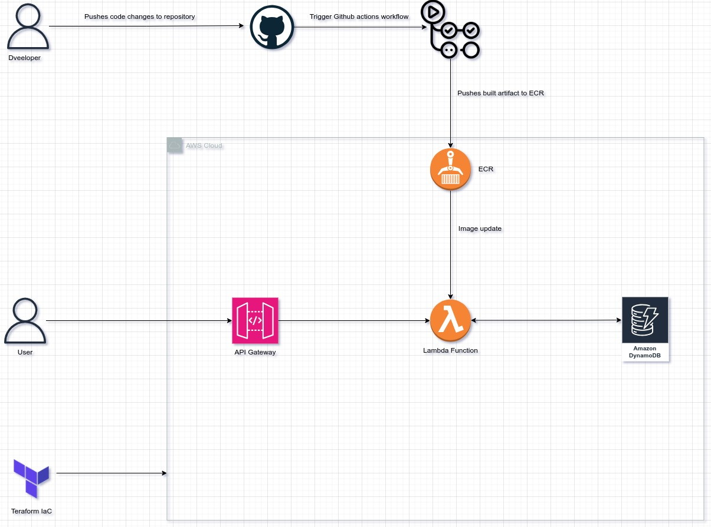

# Cloud Resume API

## Overview

The project is a serverless API that fetches resume data from a DynamoDB table and returns it in JSON format. It integrates GitHub Actions to automate the deployment process, ensuring that any updates to the Lambda function are seamlessly deployed to AWS upon pushing changes to the code base.



The project includes the following key components:

* **DynamoDB Table** : A table named `Resumes` that stores the resume data.
* **Lambda Function** : The function fetches and returns resume data based on an ID parameter.
* **API Gateway** : API Gateway will be configured to make your Lambda function accessible over the internet, or alternatively, you can use Function URLs.
* **GitHub Actions** : Continuous integration is set up with GitHub Actions to automatically package and deploy the Lambda function on every push to the repository.

## Project Structure

```bash
.
├── app
│   ├── api.py
│   ├── api_unittest.py
│   ├── Dockerfile
│   └── requirements.txt
├── infrastructure
│   ├── api-gateway
│   │   ├── cloudwatch_logs.tf
│   │   ├── main.tf
│   │   ├── outputs.tf
│   │   └── variables.tf
│   ├── backend.tfvars
│   ├── dynamodb
│   │   ├── main.tf
│   │   ├── outputs.tf
│   │   ├── resume.json
│   │   └── variables.tf
│   ├── lambda
│   │   ├── main.tf
│   │   ├── outputs.tf
│   │   ├── role.tf
│   │   └── variables.tf
│   ├── main.tf
│   ├── output.tf
│   ├── provider.tf
│   └── variables.tf
└── README.md
```

## Infrastructure Overview

The infrastructure for the Cloud Resume API project is defined using Terraform, a tool for building, changing, and versioning infrastructure safely and efficiently. The project leverages various AWS services, including Lambda, API Gateway, DynamoDB, and CloudWatch, all provisioned and managed through infrastructure-as-code.

#### Structure and Key Components

The Terraform configurations are organized into modules, each responsible for a different part of the infrastructure:

* **`api-gateway/`** : This module sets up the API Gateway, which exposes the Lambda function as an HTTP endpoint.
* **`dynamodb/`** : This module manages the DynamoDB table that stores the resume data.
* **`lambda/`** : This module defines the Lambda function, including its permissions and runtime environment.

### Main Infrastructure Components

1. **API Gateway**: Acts as the entry point for the API, routing HTTP requests to the Lambda function. Configured with stages and routes; auto-deployment enabled for immediate updates.
2. **Lambda Function**:  Handles API logic, retrieving resume data from DynamoDB and returning it as JSON. Deployed as a container image, with necessary IAM roles and environment variables for configuration.
3. **DynamoDB**: Stores resume data. Table defined with a partition key and preloaded with resume data from a JSON file.
4. **IAM Roles and Policies**: Secure the infrastructure by managing permissions for AWS services. Roles and policies grant least-privilege access, ensuring security and compliance.
5. **CloudWatch**: Provides logging and monitoring for the API and Lambda function. Includes log groups for tracking API Gateway access and Lambda execution logs.

## GitHub Actions Workflow

The GitHub Actions workflow automates the CI/CD pipeline for the Cloud Resume API project. It includes three main jobs:  **CI (Continuous Integration)** ,  **CD (Continuous Deployment)** , and  **Report** . Here's an overview of the workflow:

#### Workflow Triggers

* **Trigger Condition** : The workflow is triggered when a pull request is merged into the `main` branch. Specifically, it ensures that the CI job only runs when the PR has been successfully merged into the `main` branch.

#### Jobs Overview

1. **CI (Continuous Integration)** :

* **Clone Repository** : Uses `actions/checkout@v3` to clone the repository with full history.
* **Get Version** : Determines the new version number using the `paulhatch/semantic-version@v5.3.0` action, following semantic versioning.
* **Configure AWS Credentials** : Configures AWS credentials using `aws-actions/configure-aws-credentials@v4` with a role specified in GitHub Secrets.
* **Login to Amazon ECR** : Logs in to the Amazon Elastic Container Registry (ECR) using `aws-actions/amazon-ecr-login@v1`.
* **Build & Push Docker Image** : Builds the Docker image for the Lambda function and pushes it to the specified ECR repository.

1. **CD (Continuous Deployment)** :

* **Condition** : Runs only if the `main` branch is updated (`if: github.ref == 'refs/heads/main'`) and depends on the successful completion of the CI job.
* **Configure AWS Credentials** : Reconfigures AWS credentials for deployment.
* **Update Lambda Function** : Updates the AWS Lambda function with the new Docker image pushed to ECR.

1. **Report** :

* **Slack Notification** : Uses `8398a7/action-slack@v3` to send a notification to Slack, providing details about the workflow's status and outcomes.

# Deploying the Cloud Resume API

To deploy the Cloud Resume API to AWS, follow these steps:

#### 1. Clone the Project

First, clone the repository to your local machine:

```bash
git clone <repository-url>
cd <repository-directory>
```

Replace `<repository-url>` with the URL of your Git repository and `<repository-directory>` with the directory name of the cloned project.

#### 2. Create an ECR Repository

Create an Amazon Elastic Container Registry (ECR) repository to store your Docker images:

1. **Navigate to the ECR Console** : Go to the [ECR Console](https://console.aws.amazon.com/ecr/home).
2. **Create a Repository** : Click on "Create repository" and configure the necessary settings (such as repository name and scan settings).
   Alternatively, you can use the AWS CLI:

```bash
aws ecr create-repository --repository-name cloud-resume-api --region <your-region>
```

Replace `<your-region>` with the AWS region you want to use.

3. Build the Docker Image
   Build the Docker image for the Lambda function:

```bash
cd app
docker build -t cloud-resume-api .
```

4. Tag and Push the Docker Image to ECR
   Tag the Docker image with the ECR repository URI and push it:

Authenticate Docker to ECR:

```bash
aws ecr get-login-password --region <your-region> | docker login --username AWS --password-stdin <account-id>.dkr.ecr.<your-region>.amazonaws.com
```

Replace `<your-region>` and `<account-id>` with your AWS region and account ID.

Tag the Image:

```bash
docker tag cloud-resume-api:latest <account-id>.dkr.ecr.<your-region>.amazonaws.com/cloud-resume-api:latest
```

Push the Image:

```bash
docker push <account-id>.dkr.ecr.<your-region>.amazonaws.com/cloud-resume-api:latest
```

5. Update Infrastructure as Code (IaC) with ECR Repository
   Update the Terraform IaC files with the ECR repository URI and the latest image tag. This ensures that the Lambda function uses the correct Docker image:

```hcl
variable "lambdaVars" {
  default = {
    function_name = "cloud-resume-api"
    image_uri     = "<account-id>.dkr.ecr.<your-region>.amazonaws.com/cloud-resume-api:latest"
    timeout       = 60
    memory_size   = 128
  }
}
```

Replace `<account-id>` and `<your-region>` with your AWS account ID and region.

6. Apply the IaC
   Navigate to the infrastructure directory and apply the Terraform configurations:

```bash
cd infrastructure
terraform init
terraform apply -var-file="backend.tfvars"
```

# Testing the Deployed API

After deploying the **Cloud Resume API** to AWS, you can test the API to ensure it's functioning as expected. Here's a step-by-step guide to testing the deployed API:

1. **Obtain the API Endpoint URL** :

* Once the deployment is complete, AWS API Gateway provides an endpoint URL for the API. You can find this URL in the API Gateway console or from the outputs of the Terraform deployment.

1. **Set Up a Testing Environment** :

* You can use tools like `curl`, Postman, or any other API testing tool to send HTTP requests to the API.

1. **Testing the `/resume` Endpoint** :

* The primary endpoint for the API is `/resume`. Here's how you can test it:

  **Using `curl`** :

```bash
curl -X GET 'https://<api-gateway-id>.execute-api.<region>.amazonaws.com/<stage>/resume'
```

 **Using Postman** :

* Open Postman and create a new GET request.
* Enter the URL in the format: `https://<api-gateway-id>.execute-api.<region>.amazonaws.com/<stage>/resume`.
* Click "Send" and inspect the response.

 **Verify the Response** :

* **Success Case** : You should receive a `200 OK` status with the JSON body containing the resume data stored in DynamoDB.
* **Error Case** : If the resume data is not found or there is an internal server error, you should receive an appropriate error message (`404 Not Found` or `500 Internal Server Error`).
